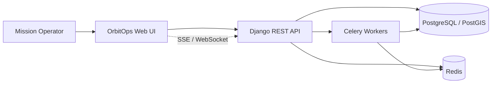
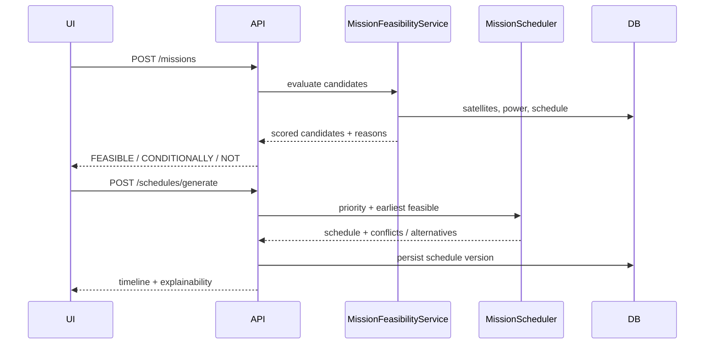

# Architecture

OrbitOps is a **modular monolith**: one Django deployable, clear domain
boundaries in code, Celery workers for heavy/async work, React SPA for ops UI.

Cesium is a visualization layer only. Authoritative orbital, feasibility,
scheduling, and power logic lives on the server.

## System context



## Containers (local)

| Service | Role |
|---------|------|
| `frontend` | Vite React SPA (dev) / static assets (prod) |
| `api` | Django + DRF + Channels/SSE endpoints |
| `worker` | Celery: propagation, passes, schedule, telemetry, conjunctions |
| `beat` | Celery beat for periodic jobs |
| `db` | PostgreSQL + PostGIS |
| `redis` | Cache, broker, short-lived computed results |

## Backend modules

```text
backend/
  config/                 # Django settings, URLs, Celery app
  apps/
    satellites/           # Satellite, TLE versioning, state
    orbit/                # Propagation, ground track (pure + services)
    ground_stations/      # Stations, antennas, availability
    missions/             # Requests, targets, feasibility, scoring
    scheduling/           # Contacts, conflicts, scheduler
    power/                # Battery / solar / eclipse model
    telemetry/            # Simulation, snapshots, anomalies
    conjunctions/         # Events, workflow, maneuver sim
    operations/           # Dashboard KPIs, alerts, time travel
    audit/                # Operator actions vs system events
  domain/                 # Shared domain types, units, errors (optional shared)
  infrastructure/         # Redis cache adapters, external I/O
```

Each feature app prefers:

- `domain/` — pure models and rules
- `application/` — use cases / services
- `infrastructure/` — ORM, cache, external adapters
- `api/` — serializers, views, urls

## Data flow (mission planning)



## Async jobs

| Job | Purpose | Idempotent? |
|-----|---------|-------------|
| `propagate_constellation` | Batch positions / caches | Yes (keyed by epoch window) |
| `predict_passes` | AOS/LOS windows | Yes |
| `generate_schedule` | Optimize / resolve contacts | Yes (input hash) |
| `forecast_power` | 24h battery projection | Yes |
| `process_conjunctions` | Screen close approaches | Yes |
| `simulate_telemetry` | Emit snapshots | Yes (timestamp bucket) |

## Realtime boundaries

Realtime (SSE/WebSocket) is limited to:

- telemetry streams
- active mission execution updates
- alerts
- optional satellite position ticks

CRUD and planning remain request/response REST. See ADR-009.

## Frontend features

```text
frontend/src/features/
  satellites/
  missions/
  ground-stations/
  schedule/
  telemetry/
  power/
  conjunctions/
  map/
  alerts/
  audit/
```

Each feature owns `components/`, `api/`, `queries/`, `hooks/`, `types/`, `utils/`.

## Deployment (target demo)

- Frontend: S3 + CloudFront
- API / workers: ECS Fargate
- DB: RDS PostgreSQL
- Redis: managed
- Queue: Redis or SQS (see ADR when chosen)
- IaC: Terraform under `infra/`

## Extraction path

At larger scale, extract workers first (orbit propagation, telemetry ingestion),
then read replicas, then optional dedicated scheduling service. Details:
[scaling.md](scaling.md).
